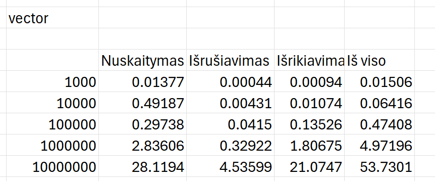
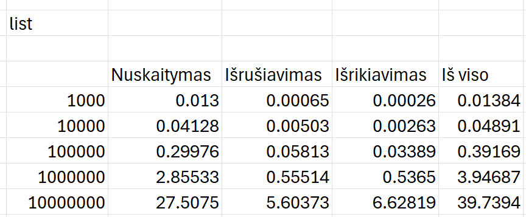
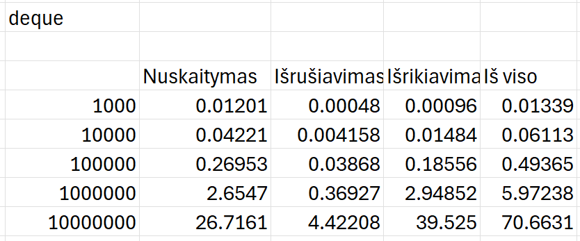

# Objektinio-programavimo-uzd

Failu generavimo laiko tyrimai 

CPU: AMD Ryzen 7 8845, 8 Cores, 3,8 GHZ 
RAM: 16 GB, 5600 MT/s 
SSD NVMe  

Vektorius  
 
 
List 
 
 
Deque 
 
 
Palyginimu grafikas 
 
 