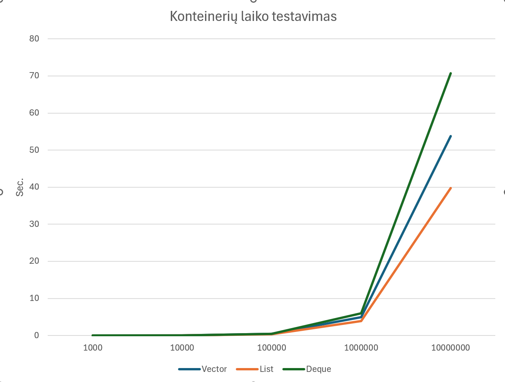
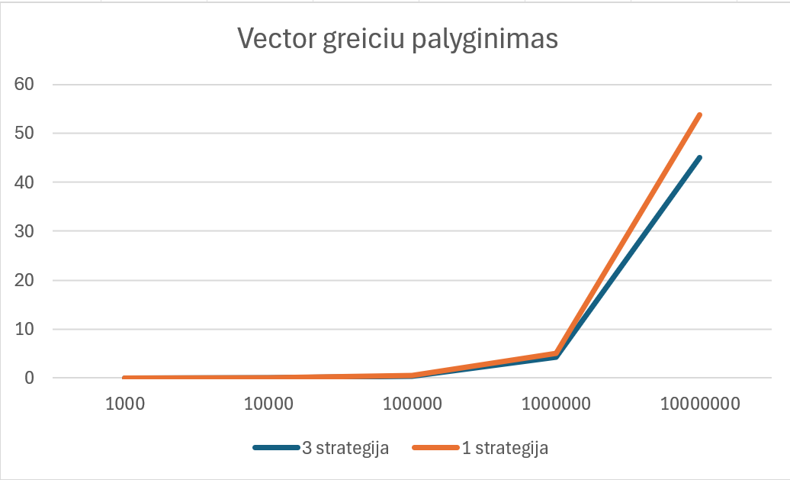

# Objektinio-programavimo-uzd

Ši programa del skirtingu konteineriu laikų testavimų naudojant struktūras
Kad paleist programa reikia tik paleisti run.bat faila

Failu generavimo laiko tyrimai 

CPU: AMD Ryzen 7 8845, 8 Cores, 3,8 GHZ 
RAM: 16 GB, 5600 MT/s 
SSD NVMe  

| vector   |             |              |              |         |
|----------|-------------|--------------|--------------|---------|
|          | Nuskaitymas | Išrušiavimas | Išrikiavimas | Iš viso |
| 1000     | 0.01377     | 0.00044      | 0.00094      | 0.01506 |
| 10000    | 0.49187     | 0.00431      | 0.01074      | 0.06416 |
| 100000   | 0.29738     | 0.0415       | 0.13526      | 0.47408 |
| 1000000  | 2.83606     | 0.32922      | 1.80675      | 4.97196 |
| 10000000 | 28.1194     | 4.53599      | 21.0747      | 53.7301 |
 

| list     |             |              |              |         |
|----------|-------------|--------------|--------------|---------|
|          | Nuskaitymas | Išrušiavimas | Išrikiavimas | Iš viso |
| 1000     | 0.013       | 0.00065      | 0.00026      | 0.01384 |
| 10000    | 0.04128     | 0.00503      | 0.00263      | 0.04891 |
| 100000   | 0.29976     | 0.05813      | 0.03389      | 0.39169 |
| 1000000  | 2.85533     | 0.55514      | 0.5365       | 3.94687 |
| 10000000 | 27.5075     | 5.60373      | 6.62819      | 39.7394 |
 

| deque    |             |              |              |         |
|----------|-------------|--------------|--------------|---------|
|          | Nuskaitymas | Išrušiavimas | Išrikiavimas | Iš viso |
| 1000     | 0.01201     | 0.00048      | 0.00096      | 0.01339 |
| 10000    | 0.04221     | 0.004158     | 0.01484      | 0.06113 |
| 100000   | 0.26953     | 0.03868      | 0.18556      | 0.49365 |
| 1000000  | 2.6547      | 0.36927      | 2.94852      | 5.97238 |
| 10000000 | 26.7161     | 4.42208      | 39.525       | 70.6631 |
| 10000000 | 27.5075     | 5.60373      | 6.62819      | 39.7394 |

 

Palyginimu grafikas 
 
 

3 strategija 

| vector   |             |              |              |         |
|----------|-------------|--------------|--------------|---------|
|          | Nuskaitymas | Išrušiavimas | Išrikiavimas | Iš viso |
| 1000     | 0.00341     | 0.00029      | 0.00073      | 0.00441 |
| 10000    | 0.05196     | 0.00258      | 0.00684      | 0.06134 |
| 100000   | 0.30253     | 0.02521      | 0.09532      | 0.42292 |
| 1000000  | 2.78892     | 0.23501      | 1.21401      | 4.23781 |
| 10000000 | 28.0751     | 2.64859      | 14.3452      | 45.0688 |
| 10000000 | 27.5075     | 5.60373      | 6.62819      | 39.7394 |
grafikas  

