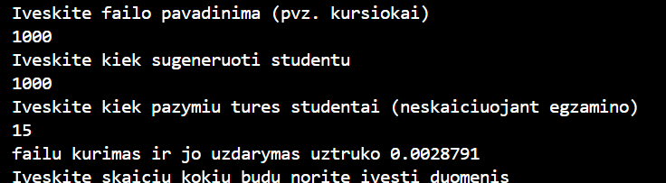
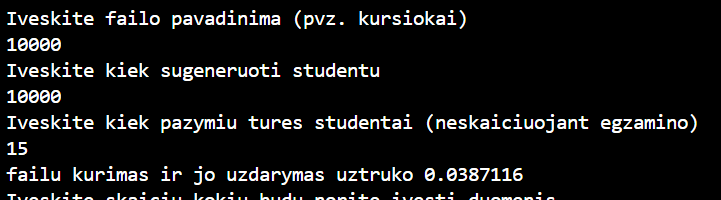
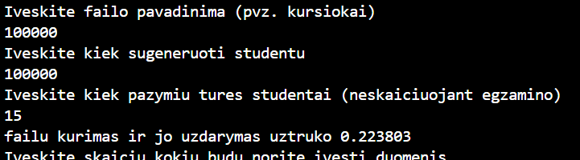
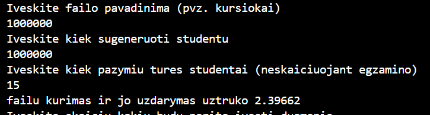
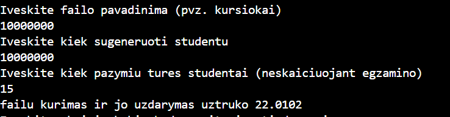
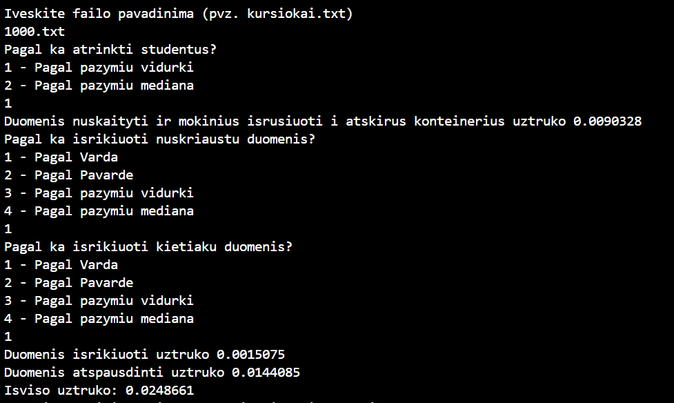
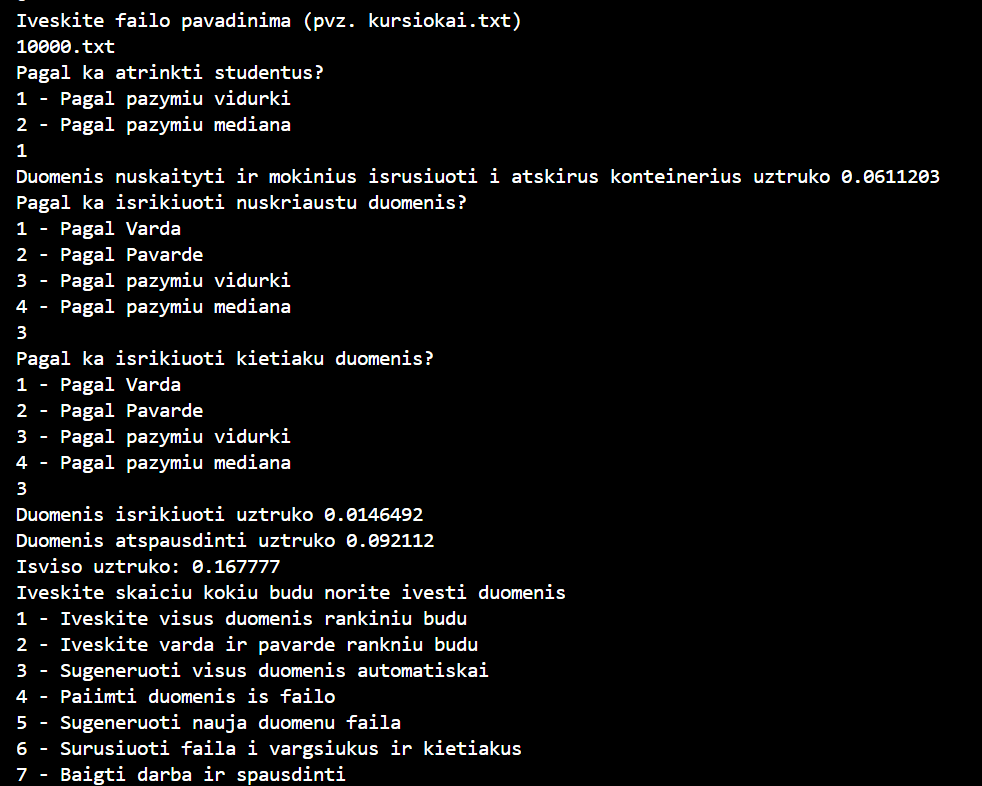
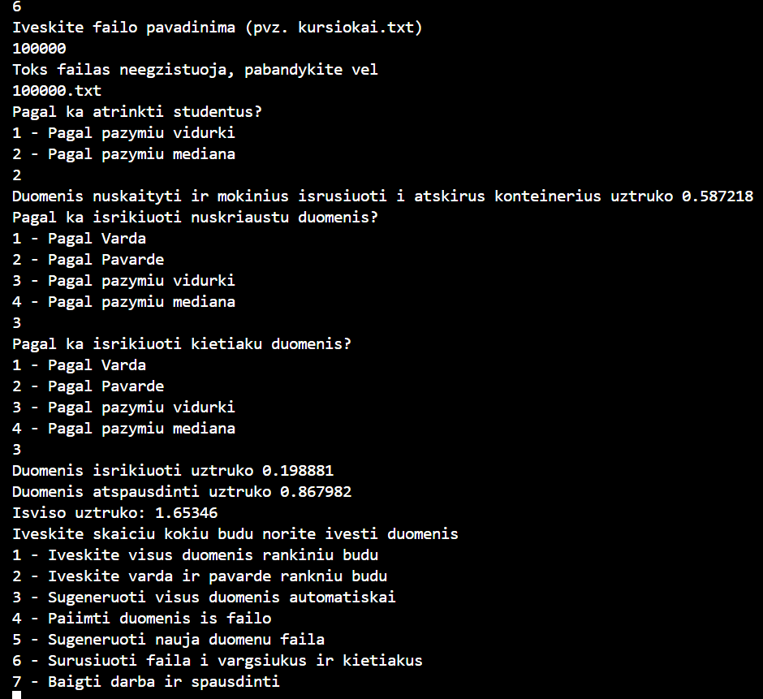
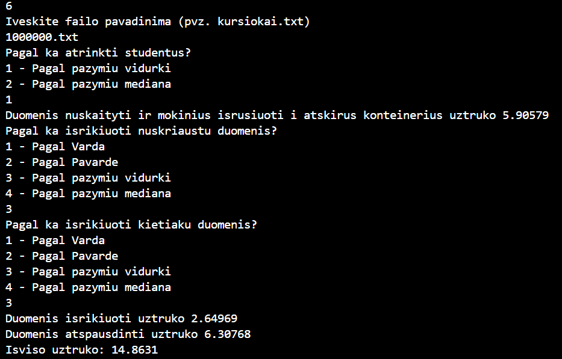
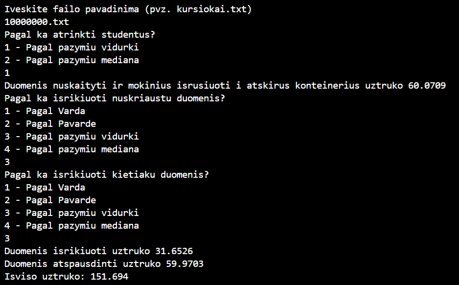

# Objektinio-programavimo-uzd

Failu generavimo laiko tyrimai
1000

10000

100000

1000000

10000000

Nuskaitymas iš failo ir rušiavimas į grupes laiko tyrimas
1000

10000

100000

1000000

10000000
